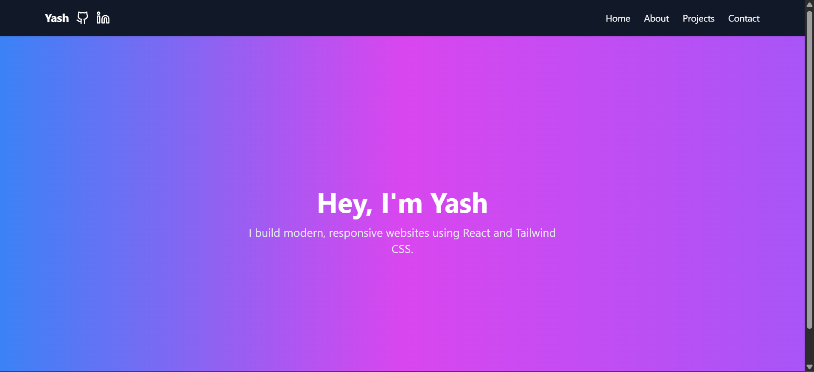

# 🚀 YashPortfolio

Hey! I'm Yash, and this is my personal portfolio — a modern, responsive website that highlights my projects, skills, and contact details.  
Built with ❤️ using **React**, **Vite**, **Tailwind CSS**, **shadcn/ui**, **Framer Motion**, and a few more cool tools.

---

## 📸 Preview

> Add a screenshot or GIF here  
> _Example:_  
> 

---

## 🛠 Tech Stack I Used

- ⚛️ React (Vite-powered for speed)
- 💨 Tailwind CSS for styling
- ✨ shadcn/ui (for polished, reusable components)
- 🎬 Framer Motion (smooth animations)
- 🔔 Sonner (for toast notifications)
- 🧩 Lucide-react (icon library)
- 🔀 React Router for navigation

---

## 🚀 Getting Started

If you want to run this locally:

### 1. Clone the Repo

```bash
git clone https://github.com/Yaash001/portfolio.git
cd YashPortfolio
```

### 2. Install Dependencies

```bash
npm install
```

### 3. Run the Dev Server

```bash
npm run dev
```

> Open [http://localhost:5173](http://localhost:5173) in your browser

---

## ✨ Features

- Fully responsive and clean UI
- Hero, About, Contact, and Projects sections
- Smooth page transitions using Framer Motion
- Toast notifications using Sonner
- Reusable component-based structure
- Built with modern dev tools from scratch 💻

---

## 🌐 Deployment

To deploy this site (e.g., on Vercel):

```bash
npm run build
```

Then push your code to GitHub and connect the repo to 


---

## 👋 About Me

I'm **Yash Lahane**, a developer passionate about building things with React and learning new tools like Docker,GIT,GITHUB etc. every day.

[](https://www.linkedin.com/in/yash-lahane-8a25a82a9/)  
[](https://github.com/Yaash001)

---


